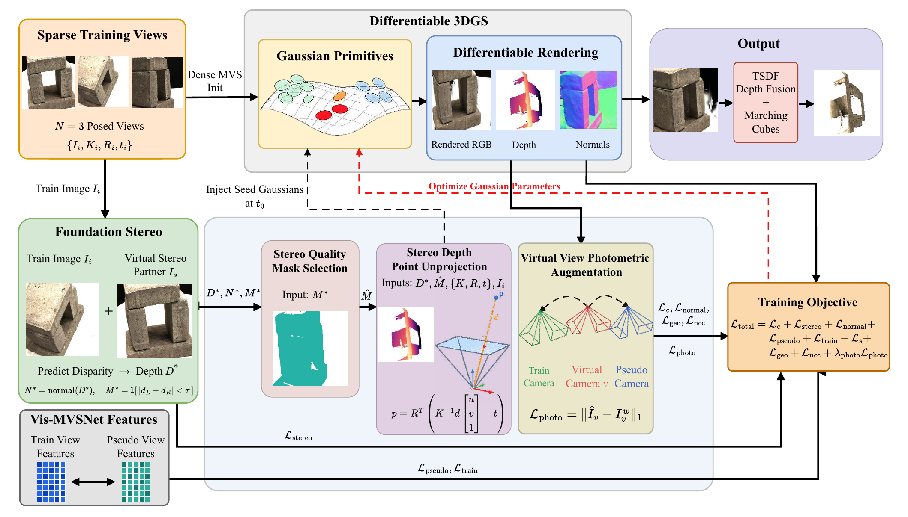

<div align="center">

# StereoSplat

### Enhanced Sparse-View 3D Gaussian Splatting via Stereo-Depth Bootstrapping

<p>
<a href="#">

</a>
<a href="https://hanalebeta.github.io/StereoSplat/">

</a>
<a href="https://github.com/HanaLebeta/StereoSplat">

</a>
<a href="#">

</a>
<a href="#">

</a>
<a href="LICENSE">

</a>
</p>

**Hana L. Goshu<sup>1</sup>, Tadesse G. Wakjira<sup>2</sup>, Kin-Man Lam<sup>1</sup>**

<sup>1</sup>The Hong Kong Polytechnic University &nbsp; <sup>2</sup>Kennesaw State University

*Under Review*

</div>

---

<div align="center">

</div>

## Abstract

Reconstructing three-dimensional (3D) scenes from a few input views remains difficult when dense image acquisition is impractical. Recent sparse-view surface reconstruction methods based on 3D Gaussian Splatting rely on stereo matching to guide optimization; however, the dense metric depth they compute is underexploited, serving merely as a loss signal that adjusts existing primitives. StereoSplat converts this overlooked depth into explicit scene geometry through Stereo-Depth Point Unprojection, Stereo Quality Mask Selection, and Virtual View Photometric Augmentation. On the DTU dataset, StereoSplat attains a PSNR of 22.78 dB on the novel-view synthesis benchmark and preserves or improves surface reconstruction accuracy.

## Code

The full implementation will be released upon publication.

## Citation

```bibtex
@article{stereosplat2025,
    title   = {StereoSplat: Enhanced Sparse-View 3D Gaussian Splatting via Stereo-Depth Bootstrapping},
    author  = {Goshu, Hana L. and Wakjira, Tadesse G. and Lam, Kin-Man},
    year    = {2025},
    note    = {Under Review}
}
```
